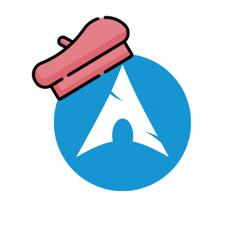

# ArchThemeM0d

<div align="center">
  
</div>
<div align="center">
  <em>ArchThemeM0d is a dynamic theming engine for Arch Linux with Hyprland that automatically generates stunning, cohesive application themes directly from your current wallpaper.</em>
</div>

## Table of Contents

- [Overview](#overview)
- [Features](#features)
- [Requirements](#requirements)
- [Installation](#installation)
- [Quick Start](#quick-start)
- [Commands](#commands)
- [Template System](#template-system)
- [Color System](#color-system)
- [Configuration](#configuration)
- [IDE (In Development)](#ide-in-development)
- [Troubleshooting](#troubleshooting)
- [Contributing](#contributing)
- [API Reference](#api-reference)

## Overview

ArchThemeM0d transforms your desktop experience by creating a unified color scheme across all your applications based on your wallpaper.

### How It Works

The system operates in two phases:

1. **Color Extraction**: Analyzes your wallpaper to extract a 16-color palette using advanced color theory
2. **Theme Generation**: Classifies colors into Material You-inspired design roles and generates complete tonal systems

## Features

- 🎨 **Wallpaper-Based Generation**: Automatically creates rich color palettes from your current wallpaper
- 🧠 **Intelligent Color Classification**: Assigns colors to Primary, Secondary, Tertiary, and Neutral roles using Material You principles
- 🌈 **Material You-Inspired Palettes**: Generates 13-tone ramps for each color role using HCT color space
- 📐 **Template-Driven Architecture**: Easily extend support to any text-based configuration
- 🔄 **Multi-Monitor Support**: Handles different wallpapers per monitor
- ⚡ **High Performance**: Written in Go for speed and efficiency
- 🎯 **Cohesive Experience**: Ensures all applications share harmonious colors
- 🖥️ **Interactive IDE**: (In Development) Web-based template editor for easy customization

## Requirements

### System Requirements
- **OS**: Arch Linux
- **WM**: Hyprland
- **Wallpaper Manager**: hyprpaper
- **Go**: Version 1.24.5 or higher

### Dependencies
- `hyprctl` (part of Hyprland)
- `hyprpaper` for wallpaper management

## Installation

### From Source

```bash
# Clone the repository
git clone https://github.com/oarabilekoore/archThemeM0d
cd archThemeM0d

# Build the binary
go build -o archThemeM0d main.go

# Install to your PATH (optional)
sudo mv archThemeM0d /usr/local/bin/
```

### Directory Structure

After installation, create the following directory structure in your home directory:

```
~/Templates/ThemeM0d/
├── Templates/          # Your .tmpl files go here
├── Themes/            # Generated themes (auto-created)
└── currenttheme.tm0d  # Generated palette data (auto-created)
```

## Quick Start

### Basic Usage

1. **Generate color palette from wallpaper**:
   ```bash
   archThemeM0d generate
   ```

2. **Build themes from templates**:
   ```bash
   archThemeM0d build
   ```

3. **Launch interactive IDE** (In Development):
   ```bash
   archThemeM0d serve --port 8080
   ```

### First Time Setup

1. Create the template directory:
   ```bash
   mkdir -p ~/Templates/ThemeM0d/Templates
   ```

2. Copy example templates:
   ```bash
   # Copy from the examples directory
   cp examples/*.tmpl ~/Templates/ThemeM0d/Templates/
   ```

3. Generate and build:
   ```bash
   archThemeM0d generate
   archThemeM0d build
   ```

4. Your themed files will be in `~/Templates/ThemeM0d/Themes/[monitor-name]/`

## Commands

### `generate`

Extracts color palette from your current wallpaper(s).

```bash
archThemeM0d generate
```

**What it does:**
- Queries hyprpaper for active wallpapers
- Extracts 12 dominant colors per wallpaper using advanced algorithms
- Classifies colors using Material You principles
- Saves palette data to `currenttheme.tm0d`
- Handles multi-monitor setups automatically

**Output:** JSON file containing monitor-specific color palettes

### `build`

Processes templates using the generated color palette.

```bash
archThemeM0d build
```

**What it does:**
- Reads palette data from `currenttheme.tm0d`
- Classifies colors into design roles using HCT color space
- Generates complete tonal palettes (13 tones per role)
- Processes all `.tmpl` files in Templates directory
- Outputs themed configuration files

**Output:** Themed configuration files in `Themes/[monitor-name]/`

### `serve` (In Development)

Launches the interactive template IDE for easier theme management.

```bash
archThemeM0d serve [--port 8080]
```

**What it does:**
- Starts a local web server with the theme IDE
- Provides real-time template editing
- Shows live preview of color changes
- Automatically rebuilds themes on save

**Features:**
- File management for templates
- Syntax highlighting for template files
- Live color palette preview
- Real-time theme generation

## Template System

### Template Basics

Templates use Go's `text/template` syntax with custom functions for color manipulation.

### Available Data Structure

```go
type TemplateData struct {
    Monitor string           // Monitor name (e.g., "DP-1")
    Theme   ClassifiedTheme  // Complete Material You color system
}

type ClassifiedTheme struct {
    Primary   TonalPalette  // Primary color system
    Secondary TonalPalette  // Secondary color system
    Tertiary  TonalPalette  // Tertiary color system
    Neutral   TonalPalette  // Neutral color system

    // Pre-defined surface colors (Material You spec)
    Surface          color.RGBA  // App backgrounds
    SurfaceVariant   color.RGBA  // Cards, dialogs
    OnSurface        color.RGBA  // Text on Surface
    OnSurfaceVariant color.RGBA  // Secondary text
    PrimaryFixed     color.RGBA  // Consistent primary
    OnPrimaryFixed   color.RGBA  // Text on PrimaryFixed
}
```

### Template Functions

#### `toHex`
Converts a color to hexadecimal format.

```go
{{.Theme.Primary | tone 80 | toHex}}
// Output: #ff5722
```

#### `toRgba`
Converts a color to RGBA format with alpha.

```go
{{.Theme.Primary | tone 80 | toRgba "0.8"}}
// Output: rgba(255, 87, 34, 0.8)
```

#### `tone`
Extracts a specific tone level from a tonal palette.

```go
{{.Theme.Primary | tone 50}}        // Mid-tone
{{.Theme.Secondary | tone 90}}      // Very light
{{.Theme.Neutral | tone 10}}        // Very dark
```

### Template Examples

See the `examples/` directory for complete template examples including:

- **Waybar** (`waybar.css.tmpl`): Status bar theming
- **Rofi** (`rofi.rasi.tmpl`): Application launcher theming
- **Dunst** (`dunstrc.tmpl`): Notification daemon theming

## Color System

### Design Principles

ArchThemeM0d follows Material You design principles with advanced color science:

- **HCT Color Space**: Uses Hue, Chroma, Tone for perceptually uniform colors
- **Intelligent Classification**: Analyzes vibrancy, hue relationships, and chroma
- **Harmonious Relationships**: Ensures complementary, triadic, and analogous color harmony
- **13-Tone Ramps**: Complete tonal palettes from dark (0) to light (100)

### Color Roles

- **Primary**: Most prominent brand/accent color (highest vibrancy)
- **Secondary**: Supporting color with harmonious hue relationship
- **Tertiary**: Additional accent for balance and variety
- **Neutral**: Low-chroma colors for backgrounds and surfaces

### Tone Levels

Each color role includes 13 tone levels following Material You specification:

| Tone | Usage | Description |
|------|-------|-------------|
| 0    | Black | Pure black |
| 10   | Very Dark | Dark surfaces, text on light |
| 20   | Dark | Dark elements |
| 30   | Medium Dark | Hover states |
| 40   | Medium Dark | Borders, dividers |
| 50   | Medium | Disabled text |
| 60   | Medium Light | Secondary text |
| 70   | Light | Primary text on dark |
| 80   | Light | Seed color placement |
| 90   | Very Light | Text on dark surfaces |
| 95   | Near White | Light surface variants |
| 99   | Nearly White | Background highlights |
| 100  | White | Pure white |

### Advanced Color Classification Algorithm

1. **HCT Conversion**: All colors converted to perceptually uniform HCT color space
2. **Vibrancy Calculation**: Material You formula combining chroma and tone
3. **Hue Analysis**: Identifies complementary, triadic, and analogous relationships
4. **Role Assignment**:
   - Primary: Highest vibrancy score
   - Secondary: Harmonious hue relationship with Primary
   - Tertiary: Distinct from Primary/Secondary with good contrast
   - Neutral: Lowest chroma for backgrounds
5. **Tonal Generation**: 13-step ramps maintaining hue and chroma consistency

## Configuration

### Multi-Monitor Setup

ArchThemeM0d automatically handles multiple monitors:

```json
[
  {
    "monitor": "DP-1",
    "theme": {
      "wallpaper_location": "/path/to/wallpaper1.jpg",
      "palletes": [...colors...]
    }
  },
  {
    "monitor": "HDMI-A-1",
    "theme": {
      "wallpaper_location": "/path/to/wallpaper2.jpg",
      "palletes": [...colors...]
    }
  }
]
```

Templates are processed per monitor, creating separate theme files for each.

### Hyprland Integration

Add to your Hyprland config for automatic theme updates:

```bash
# ~/.config/hypr/hyprland.conf

# Bind theme regeneration to a key
bind = $mainMod SHIFT, T, exec, archThemeM0d generate && archThemeM0d build && ~/.config/scripts/reload-apps.sh

# Auto-reload on wallpaper change (requires script)
exec-once = ~/.config/scripts/wallpaper-monitor.sh
```

### Reload Script Example

```bash
#!/bin/bash
# ~/.config/scripts/reload-apps.sh

# Reload applications after theme update
pkill -USR2 waybar  # Reload Waybar
pkill -USR1 dunst   # Reload Dunst notifications

# Copy themes to application directories
cp ~/Templates/ThemeM0d/Themes/*/waybar.css ~/.config/waybar/
cp ~/Templates/ThemeM0d/Themes/*/kitty.conf ~/.config/kitty/
cp ~/Templates/ThemeM0d/Themes/*/rofi-theme.rasi ~/.config/rofi/

echo "Themes reloaded!"
```

## IDE (In Development)

### Overview

The ArchThemeM0d IDE is a web-based interface for managing and editing theme templates with real-time preview capabilities.


### Current Features (Alpha)

- **File Management**: Browse and manage template files
- **Template Editor**: Edit templates with syntax highlighting
- **Live Preview**: See color changes in real-time
- **HTTP API**: RESTful endpoints for file operations

### API Endpoints

The IDE server exposes the following endpoints:

#### File Management
- `GET /files` - List all template files
- `GET /read?file=filename` - Read template file content
- `POST /update?file=filename` - Update template file (auto-builds themes)

### Usage

1. **Start the IDE server**:
   ```bash
   archThemeM0d serve --port 8080
   ```

2. **Open in browser**:
   ```
   http://localhost:8080
   ```

3. **Edit templates**: Use the web interface to modify templates and see changes instantly

### Development Status

**Current State**: Alpha - Basic functionality implemented
**In Progress**:
- React-based frontend with Tailwind CSS
- Real-time color palette display
- Template syntax highlighting
- File management interface

**Planned Features**:
- Visual color picker
- Template validation
- Theme preview gallery
- Export/import functionality
- Plugin system for custom template functions

### IDE Architecture

```
ide/
├── src/
│   ├── components/
│   │   └── header.tsx      # Navigation header
│   ├── App.tsx             # Main application
│   ├── main.tsx            # React entry point
│   └── index.css           # Styling
├── components/ui/          # Shadcn/ui components
└── dist/                   # Built assets
```

**Backend**: Go HTTP server with file management endpoints
**Frontend**: React + TypeScript + Tailwind CSS
**Build System**: Vite for fast development and building

## Troubleshooting

### Common Issues

#### "This only works with arch hyprland"
**Cause**: Not running in Hyprland environment
**Fix**: Ensure `HYPRLAND_INSTANCE_SIGNATURE` environment variable is set

#### "No Wallpapers Found"
**Cause**: hyprpaper not running or no wallpapers set
**Fix**:
```bash
# Check hyprpaper status
hyprctl hyprpaper listactive

# Set a wallpaper
hyprpaper preload ~/wallpapers/image.jpg
hyprpaper wallpaper "DP-1,~/wallpapers/image.jpg"
```

#### "IDE server fails to start"
**Cause**: Missing web assets or incorrect file paths
**Fix**: Ensure the `ide/dist/` directory contains built assets

#### "Template parsing failed"
**Cause**: Syntax error in template
**Fix**: Check template syntax, ensure proper `{{}}` delimiters

#### "Failed to get palette"
**Cause**: Corrupted or unsupported image format
**Fix**: Use JPG or PNG images, check file permissions

### Debug Mode

Add debug output by modifying template functions:

```go
{{printf "Primary 80: %s" (.Theme.Primary | tone 80 | toHex)}}
```

### File Permissions

Ensure proper permissions:
```bash
chmod 755 ~/Templates/ThemeM0d/
chmod 644 ~/Templates/ThemeM0d/Templates/*.tmpl
```

## Contributing

### Development Setup

```bash
# Clone and setup
git clone https://github.com/oarabilekoore/archThemeM0d
cd archThemeM0d
go mod tidy

# Run tests
go test ./...

# Build the main binary
go build -o archThemeM0d main.go

# For IDE development
cd ide
npm install
npm run build
cd ..

# Test the IDE
./archThemeM0d serve
```

### Adding New Template Functions

1. Add function to `funcMap` in `cmd/templatefill.go`:

```go
funcMap := template.FuncMap{
    "toHex": func(c color.RGBA) string {
        return fmt.Sprintf("#%02x%02x%02x", c.R, c.G, c.B)
    },
    "newFunction": func(args...) returnType {
        // Implementation
    },
}
```

### Code Structure

```
ArchThemeM0d/
├── main.go              # Entry point
├── cmd/
│   ├── root.go         # CLI root command
│   ├── generate.go     # Wallpaper analysis & extraction
│   ├── templatefill.go # Theme classification & building
│   ├── serve.go        # IDE server
│   └── filemanager.go  # File management API
├── ide/                # React-based IDE
│   ├── src/            # Frontend source
│   ├── components/     # UI components
│   └── dist/           # Built assets
├── examples/           # Example template files
├── go.mod              # Dependencies
└── go.sum              # Dependency checksums
```

## API Reference

### Types

#### `WallpaperInfo`
```go
type WallpaperInfo struct {
    WallpaperPath string       `json:"wallpaper_location"`
    Palletes      []color.RGBA `json:"palletes"`
}
```

#### `MonitorInfo`
```go
type MonitorInfo struct {
    Monitor string        `json:"monitor"`
    Theme   WallpaperInfo `json:"theme"`
}
```

#### `TonalPalette`
```go
type TonalPalette struct {
    Tones map[int]color.RGBA  // Tone level (0-100) to color
}
```

#### `ClassifiedTheme`
```go
type ClassifiedTheme struct {
    Primary   TonalPalette
    Secondary TonalPalette
    Tertiary  TonalPalette
    Neutral   TonalPalette

    Surface          color.RGBA
    SurfaceVariant   color.RGBA
    OnSurface        color.RGBA
    OnSurfaceVariant color.RGBA
    PrimaryFixed     color.RGBA
    OnPrimaryFixed   color.RGBA
}
```

#### `HCT` (Color Space)
```go
type HCT struct {
    H float64 // Hue (0-360)
    C float64 // Chroma (0-100+)
    T float64 // Tone (0-100)
}
```

### Functions

#### `getDominantColors(imagePath string) ([]color.Color, error)`
Extracts 12 dominant colors from an image file using advanced color quantization.

#### `classifyPaletteMaterial3(palette []color.RGBA) ClassifiedTheme`
Analyzes colors using Material You principles and generates complete theme structure.

#### `generateTonalPaletteHct(seedHct HCT) TonalPalette`
Creates 13-tone ramp from a single seed color using HCT color space.

#### `rgbToHct(c color.RGBA) HCT`
Converts RGB color to HCT (Hue, Chroma, Tone) for perceptual color analysis.

#### `calculateVibrancy(hct HCT) float64`
Calculates Material You style vibrancy score combining chroma and tone.

## Roadmap

### Version 1.0 (Current)
- ✅ Core theming engine
- ✅ Material You color classification
- ✅ Multi-monitor support
- ✅ Template system
- 🚧 Web-based IDE (Alpha)

### Version 1.5 (Planned)
- 📋 Complete IDE implementation
- 📋 Visual color picker
- 📋 Template validation
- 📋 Plugin system

### Version 2.0 (Future)
- 📋 Support for other window managers
- 📋 Advanced color harmony algorithms
- 📋 Community template marketplace

## License

This project is under the MIT License.

## Acknowledgments

- Material You Design System by Google (Inspiration)
- colorthief-go for color extraction
- Cobra CLI framework
- The Hyprland community (I use arch btw)
- React and the modern web ecosystem

---

**Made with ❤️ by Oarabile Koore**

*Join the community of Arch users creating beautiful, cohesive desktop experiences!*
